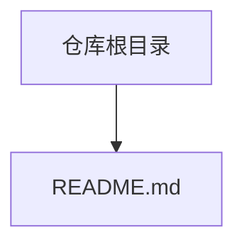
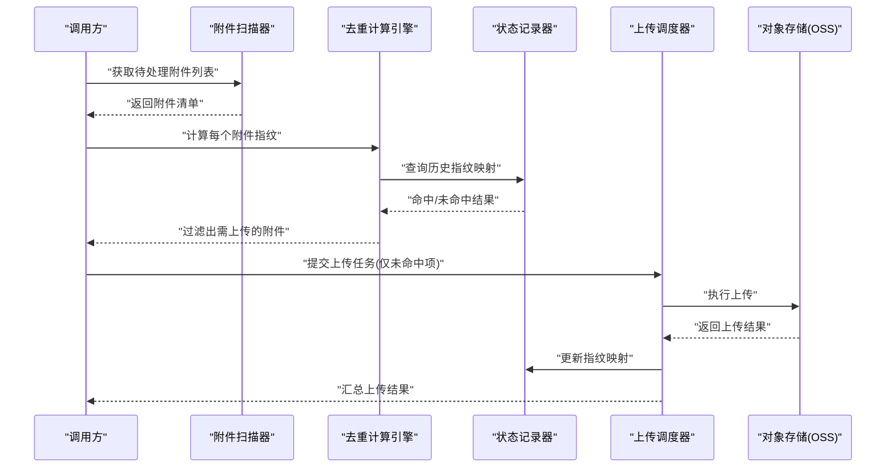
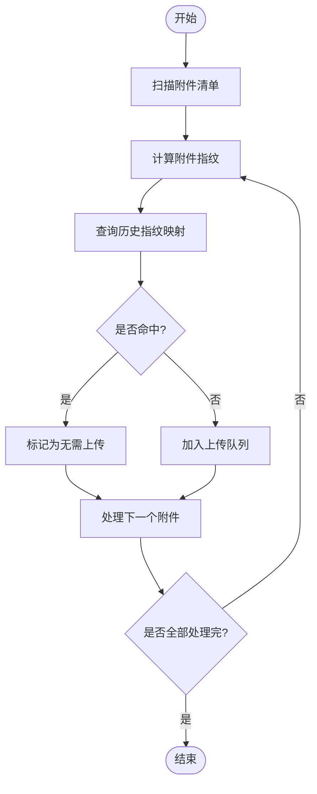

# 项目概览

<cite>
**本文引用的文件**   
- [README.md](file://README.md)
</cite>

## 目录
1. [简介](#简介)
2. [项目结构](#项目结构)
3. [核心组件](#核心组件)
4. [架构总览](#架构总览)
5. [详细组件分析](#详细组件分析)
6. [依赖分析](#依赖分析)
7. [性能考虑](#性能考虑)
8. [故障排查指南](#故障排查指南)
9. [结论](#结论)
10. [附录](#附录)

## 简介
本项目的目标是在应用或工作流中，将“未更改的附件”高效地上传至对象存储服务（OSS），避免重复上传与存储浪费。通过识别内容未变更的附件并复用已有对象，实现：
- 降低网络带宽与存储成本
- 缩短上传耗时，提升整体吞吐
- 简化运维与数据一致性管理

本项目面向初学者提供清晰的使用路径，同时为有经验的开发者提供可落地的技术要点与扩展建议。

## 项目结构
当前仓库包含一个说明性文档，用于阐述项目背景、目标与使用方式。实际代码与配置可根据业务场景进行扩展与集成。

图表来源
- [README.md](file://README.md)

章节来源
- [README.md](file://README.md)

## 核心组件
基于项目目标，典型实现通常包含以下关键组件（概念性说明）：
- 附件扫描器：遍历待处理附件集合，提取元信息（如文件名、大小、时间戳等）。
- 去重计算引擎：对附件内容进行指纹计算（例如哈希），判断是否已存在于 OSS。
- 上传调度器：仅对新增或变更的附件发起上传任务，支持并发与重试。
- OSS 客户端：封装对象存储 SDK，统一处理鉴权、分片、断点续传等能力。
- 状态记录器：持久化已上传对象的指纹与位置，便于后续快速比对。
- 配置中心：集中管理 OSS 连接参数、并发度、超时策略等。

上述组件的职责边界清晰、耦合度低，便于按模块独立演进与测试。

## 架构总览
下图展示从“发现未更改附件”到“选择性上传至 OSS”的整体流程。该流程强调“先判后传”，在本地完成去重决策后再与远端交互，从而减少无效请求。

[此图为概念性流程图，不直接对应具体源码文件]

## 详细组件分析

### 去重计算与判定流程
该流程聚焦于如何高效判断附件是否“未更改”。核心思路是：
- 生成稳定的内容指纹（如哈希值）
- 与历史记录比对，命中则跳过上传
- 未命中则进入上传队列

[此图为概念性流程图，不直接对应具体源码文件]

### 上传调度与可靠性
为保证大规模附件上传的稳定性和效率，建议采用如下机制：
- 并发控制：限制并发数，避免打满网络或存储端限流。
- 失败重试：对瞬时错误进行指数退避重试。
- 幂等设计：以指纹作为对象键的一部分，确保重复触发不会产生不一致。
- 进度与日志：记录每步操作与异常，便于定位问题。

[本节为通用实践建议，不涉及具体源码文件]

## 依赖分析
由于当前仓库仅包含说明文档，未包含具体实现代码，因此不存在直接的代码级依赖关系图。若后续引入 SDK 或框架，建议在依赖管理中明确版本约束，并对第三方库进行安全与兼容性评估。

[本节为通用指导，不涉及具体源码文件]

## 性能考虑
- 优先本地去重：在本地完成指纹计算与比对，再发起网络请求，显著降低无效传输。
- 合理并发：根据网络带宽、CPU 与 OSS 限流策略调整并发度，避免资源争用。
- 批量与分片：大文件可采用分片上传；小文件可合并批次以减少握手开销。
- 缓存命中优化：维护高效的本地索引（如内存表或轻量数据库），加速查找。
- 监控与告警：关注上传成功率、平均时延与吞吐指标，及时发现问题。

[本节为通用指导，不涉及具体源码文件]

## 故障排查指南
常见问题与定位建议：
- 上传失败：检查网络连通性、鉴权配置与 OSS 配额；查看重试与错误码。
- 重复上传：确认指纹算法一致性与历史记录完整性；核对对象命名规则。
- 性能瓶颈：观察 CPU、I/O、网络占用；调整并发与批大小。
- 数据不一致：校验本地索引与远端对象是否存在差异；必要时进行全量重建。

[本节为通用指导，不涉及具体源码文件]

## 结论
通过将“未更改的附件”识别与“选择性上传”结合，该项目能够在保证数据一致性的前提下，有效降低成本与延迟。其模块化设计与可扩展性使其适用于多种业务场景，包括文档系统、媒体资产管理、备份归档等。

## 附录

### 安装与配置（概念性步骤）
- 准备环境：安装运行环境与必要的 SDK。
- 配置凭据：设置 OSS 访问密钥、区域与桶名等。
- 初始化索引：首次运行时构建本地指纹映射。
- 运行任务：指定输入目录或数据源，启动上传流程。

[本节为通用指导，不涉及具体源码文件]

### 基本使用示例（概念性步骤）
- 选择附件来源：本地目录、消息队列或数据库中的附件元数据。
- 执行去重：计算指纹并与历史记录比对。
- 提交上传：仅对未命中项发起上传。
- 查看结果：汇总成功与失败统计，输出日志与报告。

[本节为通用指导，不涉及具体源码文件]