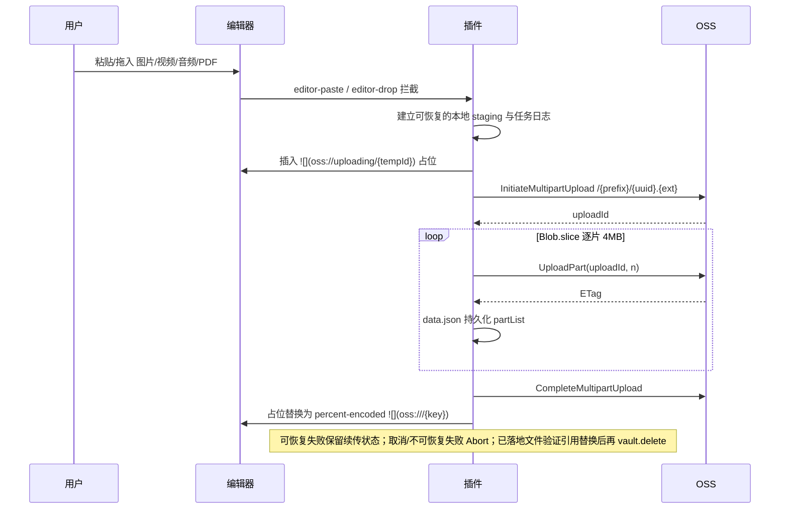

>当前文档是项目的根入口文档，定义项目全局总览框架信息
>
>Agent 接到任务需要查阅内容时优先下钻本地关联的文档，未找到再搜索网络，不单纯依赖模型预训练数据

# 是什么

>描述功能的组成要素和连接关系，每个要素和连接关系附一句话简介。先总后分，层级管理引用文档，可不断下钻。只包含与具体实现技术无关的功能描述

开发一个Obsidian插件，可以在PC端（windows、macOS）和移动端（ios、安卓）上同时兼容使用，功能点：

- 用户安装插件后可配置阿里云 OSS 所需的 `region`、`bucketName`、AK/SK、可选标准 `endpoint`、Object Key 前缀和签名有效期；不提供 CNAME/自定义访问域名

- 插件感知 Obsidian 中图片、视频、音频、PDF 的上传，先建立可恢复本地副本，再上传 OSS、验证引用替换，最后按安全条件清理本地文件

- 渲染显示的时候，对上传文件的访问路径进行动态签名和显示

- 用户从插件附件菜单或文档菜单显式删除时，提示是否联动删除 OSS 对象；原生删除不静默操作远端

- 设置页提供「自动上传」开关（toggle），关闭后暂停自动上传，方便调试或离线编辑

- 设置页保存时对 OSS 凭证进行连通性校验（ping），验证 AK/SK 有效性，校验失败提前报错阻止保存

# 为什么

>描述功能的意义，按以下维度展开：
>
>- 业务价值：什么人在什么场景解决什么事
>
>- 技术价值：可监控、高安全、高可用、高扩展、高性能等
>
>- 成本与风险：实现代价与潜在风险

- 业务价值：让多端 Obsidian 用户把大体积媒体放在私有 OSS，Vault 只保留稳定、可同步和可编辑的永久引用，减少本地附件与同步压力。
- 技术价值：V4 动态签名避免持久化临时 URL；durable staging、Multipart journal 与显式删除把网络中断、崩溃和误删从数据损失降为可恢复任务。
- 成本与风险：插件无服务端，部署简单但 AK/SK 目前明文存在 Vault 插件数据中；用户承担 OSS 存储/流量成本，可选核验还需要 ListObjects 权限。客户端凭证模式只适合个人可信设备，不应分发共享高权限 AK。

# 怎么样

>描述功能的具体实现。流程、约束、规则中的内容只与「是什么」描述的要素和连接关系相关

## 流程

### 配置

用户在设置页填写：`region`（V4 签名地域，如 `cn-hangzhou`；兼容输入旧格式 `oss-cn-hangzhou` 并归一化）、`bucketName`、`accessKeyId`、`accessKeySecret`、`endpoint`（可选）、`objectKeyPrefix`（默认 vault 名且禁止为空）、`signedUrlExpireSeconds`（默认 3600，最大 604800）、`autoUpload`（默认 true）。当前配置明文存 `data.json`；后续迁移 SecretStorage 时必须先调整最低 Obsidian 版本与本节规则。

保存时插件用已填凭证对 `{objectKeyPrefix}/.oss-plugin-probe/{randomUUID}` 发送签名 GET，该随机 Key 必然不存在，只有 OSS 明确返回 `404 NoSuchKey` 或极小概率的 `200` 才视为校验成功。`objectKeyPrefix` 禁止以 `/` 开头，首段禁止为占位命名 `uploading`，任一段禁止为内部探针命名 `.oss-plugin-probe` 或 URL 点路径 `.` / `..`。禁止用 ListObjects 作为凭证探针，避免插件获得枚举 Bucket 对象名称的权限。其他失败则 Notice 报错并阻止保存。`autoUpload` 变为 false 时，新拦截与 `vault.on('create')` 补传立即跳过，已开始的自动任务在下一次 Initiate/Part/Complete 前安全暂停并保留恢复状态；已有 `oss://` 链接的渲染和显式删除不受影响。

所有 OSS 数据 API、管理 API 和附件签名访问 URL 统一使用标准 `{bucket}.{endpoint}` Host，默认 Endpoint 为 `oss-{region}.aliyuncs.com`。所有请求和预签名 URL 必须使用 OSS Signature V4（`OSS4-HMAC-SHA256`），禁止继续生成 V1 `Authorization: OSS ...` 或 HMAC-SHA1 URL。不提供自定义访问域名配置，避免 Bucket 归属、ACL、HTTPS 证书与 DNS 引入额外故障面。

当前 no-CNAME 架构的产品覆盖边界必须如实展示：2025 年 3 月 20 日前已开通 OSS 服务的用户不受影响；非中国内地 Region 不受这项公网策略影响。该日期后新开通 OSS 服务的用户访问中国内地 Bucket 时，阿里云会阻断默认公网域名上的数据类 API 并返回 `400 PublicEndpointForbidden`，当前版本因此不支持这组配置。凭证探针遇到该错误必须阻止保存并明确提示“当前不支持 CNAME，请在首次配置时改用非中国内地 Region”；禁止把自定义域名伪装成 `endpoint` 绕过当前 Host 与存储身份模型。

后续若要覆盖上述中国内地新用户，必须先更新本文档再实现 CNAME：自定义访问 Host 应作为独立于 Region Endpoint 的显式字段，纳入不可变存储身份、签名缓存键和迁移判断；保存前必须验证 hostname、HTTPS 证书、DNS 与目标 Bucket 的绑定关系；所有受限数据 API 与预签名 URL 必须使用同一个已验证 Host。未完成这些约束前继续维持当前 no-CNAME 规则。

Bucket、Endpoint、Region 与 Object Key 前缀共同构成不可变的存储身份。Object Key 前缀中的可见空格属于真实 Key，旧配置不得在加载或轮换凭证时静默 `trim`；任何会改变前缀字节的归一化都必须视为存储身份迁移。未完成任务必须持久化该身份并只用原身份续传；存在任务时禁止把旧 `uploadId` 或已完成 Object 提交到新身份。当前 `oss://` 格式不携带 Bucket，因此设置页变更存储身份时必须显式阻止或走专用迁移流程，禁止静默切换导致历史引用失效。AccessKey 可在同一存储身份内轮换。

### 上传

统一走 OSS Multipart Upload，不按大小分流。

`editor-paste/editor-drop` 直传监听在插件加载时立即注册；接管输入后必须先在 Vault 根目录 `.oss-plugin-staging/` 建立 `{tempId}.{ext}.stage` 可跨重启恢复文件，再执行网络上传，禁止只把进程内 Blob 当作唯一数据源。staging 必须只用 Vault API 创建/读取/删除，`vault.on('create')`、迁移与核验必须排除该内部目录，任务进入 `done` 后立即清理。所有占位符必须在事件回调内一次性插入并作为唯一提交锚点，成功或失败回写都只能原位替换占位，禁止使用上传前保存的旧光标位置。`vault.on('create')` 兜底监听必须延迟到 `workspace.onLayoutReady` 后注册，禁止接收 Obsidian 冷启动为历史文件补发的 create 事件。兜底只负责本次运行中新落地的附件，不得把当前活动文档直接视为引用来源。插件必须等待 MetadataCache 建立链接关系，先从 `resolvedLinks` 找到指向该附件的候选 Markdown，再只读取候选文档并按真实链接解析结果确定每一个引用实例；每次重试禁止扫描全 Vault。在限定等待时间内找不到引用时跳过自动上传并保留本地文件。每个引用实例必须单独上传为一个 OSS Object，逐个替换并回读确认该实例已写入自己的 `oss://` 链接；同一 Markdown 内的重复引用也不共享 Object Key。只有该本地附件的全部引用实例都已独立迁移成功，并在删除前重新解析确认没有新增本地引用，才允许删除本地文件。

插件禁用或热重载时必须同步进入 `quiescing`：已经接管并开始读取的 File 仍需完成 staging 与任务日志落盘；已发出的 OSS 请求只允许持久化其安全结果，禁止继续下一次网络请求、提交引用或删除本地文件。所有异步根任务必须被生命周期统一跟踪。跨热重载实例必须通过 `globalThis + Symbol.for(pluginId)` 共享 generation 与持久化队列：新实例读取 `data.json` 前等待旧实例 drain，旧 generation 此后禁止整包 `saveData`，避免迟到写入覆盖新实例的 pending journal。

上传失败分为两类：网络中断、超时、5xx 等可恢复错误必须保留 `uploadId + partList` 和本地附件，供状态栏重试或下次启动继续；用户主动取消、凭证/参数错误等不可恢复错误才调用 `AbortMultipartUpload` 并清除状态。续传必须校验附件大小、扩展名与原任务一致，禁止把另一个同名文件续传到旧任务。

Multipart 完成不等于迁移完成。任务状态至少覆盖 `staged → uploading → completing → uploaded → reference_committing → cleanup_pending → done`。调用 Complete 前必须先持久化 `completing`；响应不确定时用目标 Object HEAD 复核；若 HEAD 404 没有可区分 Bucket/Object 的错误体，只允许再发 `Range: bytes=0-0` 的轻量 GetObject 区分 `NoSuchKey` 与 `NoSuchBucket`，禁止下载完整附件或把任意 404 当成 Object 不存在。任务必须持久化 `objectKey + localPath/stagingPath + sourcePath + placeholder/occurrence locator + storageIdentity`；只有编辑器占位符或所有真实引用文档均已替换并验证、本地附件或 staging 清理成功后，才允许进入 `done` 并清除任务。插件重启后必须复用已完成的 Object Key 继续引用提交，禁止重复上传同一附件。

引用迁移必须先计算完整的“引用实例→独立 Object Key”计划，再逐实例上传、提交并回读验证。已成功实例不回退且不重复上传；中途失败时必须保留本地附件和未完成实例的 `uploaded/uploading` 状态供续传。附件引用定位应优先使用 Obsidian MetadataCache 的真实链接解析结果；兼容回退解析时必须支持括号、空格、尖括号与可选 title 等合法 Markdown 目标，禁止用遇到首个 `)` 即终止的简单正则判断目标范围。

附件迁移必须先用 `MetadataCache.resolvedLinks` 生成候选附件与候选 Markdown，再只读取候选文档确认真实引用实例。“迁移指定文件夹附件”不得读取全 Vault Markdown；但若候选附件被范围外 Markdown 引用，必须继续纳入这些引用，以保证删除本地附件前所有引用均已迁移。自动补传可使用仅存于运行期的本地附件反向链接缓存，但必须在 MetadataCache 重新解析后失效，且禁止写入 `data.json`。

粘贴或拖入同时包含支持与不支持的 File 时，插件不得整体 `preventDefault()` 后吞掉不支持文件。只有本次 File 列表全部是可处理附件时才接管默认行为；剪贴板随文件附带的 `text/plain`、`text/html`、文件名或 URL 属于同一内容的替代表达，不得仅因这些 string item 放弃直传。真正含不支持 File 的混合输入交给 Obsidian 默认落盘，再由 `vault.on('create')` 精确补传。

### 渲染

Reading View 只用 `registerMarkdownPostProcessor` 处理当前渲染片段；Live Preview 与 Canvas 在 `workspace.onLayoutReady` 后共用一个增量 `MutationObserver`，只处理 `.markdown-source-view` / `.canvas-node` 中本批次发生变化的目标节点与新增子树，禁止在 Observer 回调中重新扫描 `document`。

所有渲染入口统一调用 `SignedUrlResolver`：缓存键由 `bucket + signedHost + objectKey` 组成，LRU 缓存保留至过期前 60s；同一缓存键正在签名时复用同一个 Promise；返回结果必须携带 `expireAt + generation`。PDF、音频、右键菜单与图片预览在用户动作发生时重新确认 lease；图片/视频进入视口准备挂载 URL 时也必须确认当前代际与剩余有效期，禁止把早先缓存的过期 URL 延迟挂载到 DOM。凭证、Endpoint 或有效期变化时先清空已完成和进行中的缓存并失效所有 render session，旧代请求无论成功或失败都必须转用当前配置重新解析，禁止向活动节点返回旧签名 URL。插件卸载与配置切换语义必须分离：配置切换允许旧请求转向新代重新解析；卸载必须把 resolver 永久置为 disposed，禁止 in-flight 请求复活。Reading View 尚未挂入 workspace 的 detached fragment、已打开预览 Modal 和其监听也属于当前 render lifetime，卸载后不得继续写 DOM 或保留旧插件闭包。V4 派生 HMAC-SHA256 Key 应按 Secret、日期、Region 复用，避免每个附件重复导入和派生。

Obsidian/Electron 规范化出的 `oss:///%E8...` 必须先恢复为原始 Object Key，再生成签名 URL。图片、视频、音频分别渲染为对应原生元素；PDF 只渲染为轻量附件卡片，名称优先取 Markdown 图片语法的 alt 文本（如 `` 中的 `报告名称.pdf`），alt 为空时才回退到 Object Key 文件名。卡片展示 PDF 类型标识、完整名称和“打开”操作，名称过长时单行省略并通过 title 保留完整内容；禁止下载 PDF 二进制、创建 Canvas、启动 Worker 或内嵌系统 PDF 查看器。每个 PDF 必须独立签名和渲染，连续多个 PDF 中单个失败不得影响其他 PDF。异步签名完成后必须再次核对节点当前 Object Key，禁止旧结果覆盖被 Obsidian 复用的节点。批量渲染必须逐节点隔离失败，失败时保留原始 `oss://` 并显示独立错误标记，允许后续视图刷新重试。

图片、视频、音频必须使用统一的“附件容器 → 媒体 → 名称”纵向布局，在媒体正下方显示 Markdown 图片语法 `[]` 中的名称，Reading View、Live Preview 与 Canvas 的位置和间距保持一致；名称为空时不显示标题，也不得回退展示 OSS UUID。标题过长时单行省略，并通过 `title` 保留完整名称。音频播放器、音频附件容器和 PDF 卡片在 Reading View、Live Preview 与 Canvas 中都必须按父容器 `width: 100%` 占满正文可用行宽，禁止使用固定像素宽度或依赖屏幕分辨率；Live Preview 必须在渲染时给实际的 `.image-wrapper`、`.cm-embed-block`、`.internal-embed` 和所在 `.cm-line` 添加专用展开类。尤其禁止遗漏 Obsidian 默认 `display:inline-flex` 的 `.image-wrapper`，否则其收缩宽度会把音频压成 0px、把 PDF 卡片限制为内容宽度。只允许添加样式类，禁止替换这些 CodeMirror 编辑入口节点。

媒体渲染必须避免无意义的 OSS 数据流量：PDF 卡片只挂载可点击的签名链接，未点击时不得请求 PDF 内容；音频挂载签名 URL 时必须使用 `preload="none"`，允许原生播放器正常识别音源但不得预下载音频内容；视频只在进入视口附近时挂载签名 URL 并使用 `preload="metadata"` 读取小段数据展示首帧，视口外不得提前请求；图片只在进入视口附近时挂载签名 URL，不可见的长文档和 Canvas 图片不得提前下载。延迟图片占位节点必须保留非零布局区域，禁止用 `display:none` 造成可见性观察死锁。环境不支持可见性观察时允许立即加载图片和视频，以保证兼容性。Live Preview 中 Obsidian 未生成原生媒体元素、只生成带 `src` 的 `.internal-embed` 时，插件必须保留该可编辑宿主并在其内部挂载正确的媒体元素。

OSS 附件的右键菜单由插件统一接管，禁止让 Obsidian 将视频、音频和 PDF 显示为“复制图片 / Remove image / 重置大小”。菜单只保存 Object Key 与可验证的来源定位，不得长期保存签名 URL；打开、复制临时链接和图片预览必须在点击时重新签名。菜单项必须按图片、视频、音频、PDF 显示对应名称，提供打开附件、复制临时访问链接、复制永久 `oss://` Markdown 引用；仅在能确认来源 Markdown 与具体引用实例时提供“移除引用”。Canvas 永不提供移除引用，Live Preview 禁止回退猜测当前活动 Markdown。移除时必须按当前唯一 Object Key 先确认是否联动删除；用户选择保留 OSS 时只移除引用，用户确认联动删除时先删除 OSS Object，只有远端明确成功才精确删除一个 Markdown 引用。网络、Bucket 不存在、Endpoint 错误或 OSS 删除失败时必须保留本文档引用。

### 删除

插件不维护 OSS 引用索引，也不监听 Markdown 修改或文件删除来推断用户意图。删除操作必须来自插件提供的显式入口：单个 OSS 附件使用附件右键菜单；整篇 Markdown 使用文件右键菜单“删除文档并处理 OSS 附件”。原生 Obsidian 删除、外部同步或系统文件操作只删除本地内容，不联动删除 OSS；遗留对象由用户主动执行“核验 OSS 对象引用”处理。

“删除文档并处理 OSS 附件”必须在文档仍存在时读取内容、提取去重后的 `oss://` Object Key，并在同一弹窗中展示删除选择；远端对象默认不选中。用户确认后先调用 Obsidian `FileManager.trashFile` 将文档移入用户配置的回收位置，只有本地删除成功才处理用户选中的 OSS 对象。远端删除失败时报告逐项结果，已进入回收位置的文档允许用户恢复后重试，禁止 monkey patch `trashFile`、`vault.delete` 或 `vault.trash` 拦截原生行为。

插件冷启动禁止自动执行全 Vault 内容扫描或 OSS 管理请求。孤儿 MultipartUpload 清理、OSS 对象核验和附件迁移均只允许用户通过命令或设置页手动触发；正常的当前文档渲染、附件自动上传和显式删除入口不受影响。

删除单条引用时确认项默认选中；删除整篇 Markdown 时远端对象默认不选中，必须由用户主动逐项选择，因为一次文档删除可能影响多个对象。确认弹窗只代表当前文档，不暗示其他文档没有引用。

### OSS 对象核验

用户主动执行“核验 OSS 对象引用”命令时，插件完整分页调用 ListObjectsV2 获取 `objectKeyPrefix` 下的对象集合，并扫描 Vault 内 Markdown、Canvas 与 Base 的 `oss://` 引用集合。`OSS - Vault引用 - pendingUploads` 为疑似垃圾，`Vault引用 - OSS` 为引用失效；禁止只比较数量。

核验是唯一允许读取全 Vault 结构化内容的路径。扫描必须使用有界并发，每个文件读取后立即提取 Object Key 并释放文本，禁止同时读取并持有全部文件内容。任一文件读取失败时本次核验不得生成可删除结论；删除前二次扫描可只提取已选 Object Key，但仍必须检查全部结构化文件。

ListObjects 权限只属于可选核验能力，设置保存时的凭证探针仍禁止调用 ListObjects。核验默认只展示报告；疑似垃圾默认不选中，最近 24 小时对象禁止删除，用户选择删除后必须重新扫描 Vault 引用并跳过已恢复引用的对象。插件内部保留路径不得作为附件垃圾展示。

## 约束

- 必须只用 `requestUrl` 收发 HTTP，禁止使用 `fetch/XHR/ali-oss` SDK，因为要兼容移动端且绕 CORS。
- OSS 上传、删除、分片列表、中止和签名访问必须始终走标准 Bucket Endpoint，禁止引入自定义访问 Host。
- 必须只用 Web Crypto (`crypto.subtle`) 做签名，禁止使用 Node `crypto/fs/stream/Buffer`。
- 必须处理的附件类型：图片(png/jpg/jpeg/gif/webp/avif/svg/bmp)、视频(mp4/mov/webm/mkv/ogv/m4v)、音频(mp3/wav/m4a/ogg/flac/aac/opus)、PDF；其他类型必须不动。
- Markdown (`.md`)、Canvas (`.canvas`) 和 Base (`.base`) 属于 Vault 内可编辑、可查询的结构化内容，禁止自动上传到 OSS；必须保留在 Vault 中参与链接、搜索和编辑。
- md 中必须以标准 markdown 语法 `` 存储，三斜杠明确表示无 host 的绝对路径；Object Key 的每个路径段必须 percent-encode。禁止使用 raw 空格/括号等不安全目标、wikilink、HTML 内嵌或带签名 URL。上传、渲染、删除、核验必须共用唯一 `OssReferenceCodec`，禁止各模块复制简单正则。
- 附件若已落地为本地文件，必须在 `CompleteMultipartUpload` 成功后再 `vault.delete`，禁止先删后传。
- 附件若已落地为本地文件，只有在所有真实引用文档修改成功并回读验证后才允许 `vault.delete`；无引用、引用解析不确定、任一文档读写失败时必须保留本地文件并提示用户。
- `CompleteMultipartUpload` 成功后禁止立即删除 pending 状态；引用提交完成前必须保留可跨重启恢复的 `uploaded` 状态，避免重复对象和半迁移任务失联。
- 多文档引用提交失败时禁止留下无恢复信息的半迁移状态；安全回滚或持久化逐文档提交进度至少满足其一。
- 本地引用替换必须通过 Obsidian MetadataCache/链接解析结果确认目标附件，禁止仅按 basename 在全库正则替换，因为不同目录可能存在同名附件。
- 拦截路径必须先持久化 staging 再上传；上传失败时必须确认本地数据已存在后再把占位原位替换为本地链接，禁止先删占位或直接丢弃数据。
- `vault.on('create')` 兜底必须在 `onLayoutReady` 后注册，且引用等待每轮只能读取 MetadataCache `resolvedLinks` 命中的候选 Markdown；禁止冷启动处理历史附件或为单个新附件反复扫描全 Vault。
- 删除远端前必须二次确认，禁止跨文档引用统计带来的复杂度，误删责任由用户承担。
- 禁止创建或持久化 OSS 引用索引，也禁止监听 `modify/delete` 推断删除意图，因为破坏性远端操作必须由用户从插件显式入口发起。
- 整篇文档删除触发的远端对象必须默认不选中，禁止将批量永久删除作为默认操作。
- objectKey 必须由 `{objectKeyPrefix}/{crypto.randomUUID()}.{ext}` 组成，禁止依赖内容哈希，因为流式分片无法边传边算 SHA-1；不做内容去重，孤儿文件由用户自行清理。
- 每个 Markdown 附件引用实例必须独占一个 OSS Object Key，禁止在不同文档或同一文档的重复引用之间共享自动上传产生的 Object；用户手工复制已有 `oss://` 链接不在自动隔离范围内。
- 单个引用实例的修改必须采用“上传新 Object→替换并验证引用→再处理旧 Object”的顺序，禁止原地覆盖或先删旧对象。
- 必须对所有附件统一走 OSS Multipart Upload，禁止使用一次性 PutObject，因为路径唯一化便于维护与续传。
- 必须只在用户取消或确认不可恢复的上传失败时调 `AbortMultipartUpload`；可恢复错误必须保留续传状态，24h 以上的孤儿分片由用户手动清理，兼顾断点续传、冷启动性能与孤儿分片成本。
- `autoUpload` 为 false 时必须完全跳过新的拦截与补传；已接管任务必须在下一次 OSS 请求前暂停并保留恢复状态，禁止继续排队或静默上传，因为用户明确暂停意味着不再产生新的网络请求。
- 设置页保存必须先通过 V4 凭证校验再持久化，禁止存入无效凭证；Region 必须归一化为 V4 signing region，Endpoint 只允许 hostname，Object Key 前缀禁止为空或以 `/` 开头，签名 URL 有效期必须在 `61..604800` 秒内。
- OSS 对象核验必须完整处理 ListObjectsV2 分页，并以 Object Key 集合差为准；禁止用对象数量相等推断无垃圾，也禁止让核验所需的 ListObjects 权限成为上传和渲染的必需权限。
- 核验结果中的疑似垃圾默认不选中，最近 24 小时对象必须处于删除保护期；真正删除前必须重新扫描 Vault 引用，禁止删除扫描后恢复引用的对象。
- MutationObserver 回调必须只处理本批次变更节点和新增子树，禁止调用 `document.querySelectorAll` 或等价的全页扫描，因为 Obsidian 编辑、滚动和拖动 Canvas 会高频修改 DOM。
- Reading View、Live Preview、Canvas 必须有单一渲染责任方，禁止同一视图由两套渲染器竞争写入 URL；Reading View 归 Post Processor，Live Preview/Canvas 归增量 Observer。
- OSS 附件右键菜单必须阻止 Obsidian 图片菜单继续冒泡，并且只能对当前 Object Key 和可确认的来源 Markdown 执行操作；禁止因 DOM 外层仍为 `.image-embed` 就展示图片专属操作。
- 右键菜单移除 OSS 附件时必须遵循“确认联动删除 → 删除 OSS Object → 删除当前 Markdown 引用”的顺序；远端删除失败时禁止修改 Markdown，避免引用先丢失后无法重试远端删除。
- 渲染监听必须延迟到 `workspace.onLayoutReady` 注册；插件卸载或热重载时必须先断开 Observer、永久失效旧 resolver，再同步释放 workspace 与 detached fragment 的 render session、预览 Modal、右键菜单和媒体监听，并把已挂载签名 URL 恢复为 canonical `oss://`，禁止旧 client 闭包残留或异步复活。
- 同一批附件必须并发解析且逐项隔离异常，禁止用会因单项失败而整体 reject 的裸 `Promise.all`。
- 未配置 Bucket/AK/SK 时必须在签名前失败并保留 `oss://`，禁止生成无效 HTTPS URL 覆盖可重试源地址。
- 设置切换必须在第一个异步持久化等待前清空签名状态，且 `onLayoutReady` 回调必须检查插件是否已经卸载，禁止旧配置和卸载后的监听回写 DOM。
- 所有 `requestUrl` 必须在真正发送前通过当前插件 lifecycle generation gate；引用修改、本地/远端删除、核验和迁移也必须在副作用前检查 lifecycle。禁止只在事件入口检查一次，因为热重载可能发生在任意 `await` 之间。
- PDF 展示必须只生成签名链接按钮，禁止引入 PDF.js、Worker、Canvas 或 PDF 二进制下载，因为最高性能优先且多个 PDF 必须互不争用渲染资源。
- 音频必须使用 `preload="none"` 避免播放前下载内容，但不得移除 HTTPS `src` 而破坏原生播放；图片和视频必须优先近视口懒加载，视频仅允许 `preload="metadata"` 用于首帧识别，因为用户可识别内容比绝对零请求更重要，但视口外不应产生 OSS 下行流量。
- OSS 图片必须由插件提供可见的放大操作和独立预览 Modal，禁止依赖 Obsidian 只能解析 Vault 本地附件的原生放大链路。
- Live Preview 中 OSS 图片必须同时保留 Obsidian 原生控件和插件的 OSS 放大按钮；OSS 按钮必须向左错开原生按钮区域，禁止重叠。定位样式必须限定在 `.oss-image-preview-host` 内，禁止影响本地图片。Obsidian 原生“查看文件”对 `oss://` 可能无效，但按用户要求保留。
- 粘贴/拖拽拦截必须在事件句柄失效前并发快照所有已接管 `File` 的字节，后续上传与失败回写必须共用稳定 Blob，禁止在长时间异步上传后再读取可能已被系统撤销的原始 `File` 句柄。
- 输入附件读取返回 `NotReadableError` 或 `The requested file could not be read` 时，Notice 必须通用地提示“文件可能仅存在云盘（如 iCloud、OneDrive 等），请先下载到本地后重试”，禁止绑定单一云盘品牌或只暴露浏览器原始英文异常。
- PDF 展示名称必须优先沿用 Markdown alt 文本，禁止只显示 UUID Object Key 文件名，因为用户上传时的语义名称比存储键更有辨识度。

## 规则

- 每次代码实现完成并通过验证后，默认执行 `npm run deploy:test` 部署到 `/Users/xukai/xukai_workspace/许凯测试oss插件/.obsidian/plugins/unchanged-attachments-to-oss`，方便用户立即验证；部署只更新 `main.js`、`manifest.json`、`styles.css`，禁止覆盖测试 Vault 中的 `data.json`。

- 推荐优先在 `editor-paste/editor-drop` 阶段拦截 blob 直传，因为可避免本地落盘再删的往返。
- 推荐分片固定 4 MB 并用 `Blob.slice` 惰性切片，因为可兼顾移动端内存与 RTT 数量。
- 推荐在 `data.json` 持久化 `uploadId + partList` 以支持断点续传，因为大视频常见网络中断。
- 推荐重试任务同时持久化本地附件路径、文件大小和更新时间，因为插件重启后仍需恢复失败任务且必须防止错传同名文件。
- 推荐在设置页和命令面板提供 24h 以上未完成 MultipartUpload 的手动清理入口；禁止启动时自动请求 OSS，因为维护任务不应影响文档打开。
- 推荐用私有 Bucket + 客户端 Signature V4，因为新 UID 与新 Bucket 已不支持 V1，且 V4 使用 HMAC-SHA256 和更严格的请求规范化。
- 推荐签名 URL 内存缓存（LRU，`bucket + signedHost + key`→`{url, expireAt}`）并缓存 in-flight Promise，因为可消除滚动、Canvas 卡片与正文并发渲染造成的重复签名。
- 推荐复用 Web Crypto 导入后的 HMAC `CryptoKey`，因为 AccessKey Secret 不变时重复 `importKey` 是无意义开销。
- 推荐上传失败保留本地文件并在状态栏提示重试，因为可避免网络抖动造成数据丢失。
- 推荐同时在设置页和命令面板提供未完成任务数量与重试入口，因为 Obsidian 移动端没有状态栏；放弃任务必须另行设计本地数据保留与已完成 Object 的处理语义，禁止用“清空状态”冒充取消。
- 推荐提供"迁移指定文件夹附件"和"迁移全部附件"两条命令，因为支持先小范围验证再全量迁移。
- 推荐迁移前展示附件数量并二次确认，迁移后保留逐文件成功/失败结果；没有真实引用的附件默认跳过，因为上传后立即删除会失去本地可发现性。
- 推荐凭证校验对每次随机且不存在的保留 Key 发送签名 GET，并且只将 `NoSuchKey` 视为预期成功，因为它能验证 Bucket、Endpoint、签名和 `GetObject` 权限，又不会列举、创建或下载真实对象。
- 推荐 `autoUpload` 开关变更时在状态栏展示当前状态图标，因为可让用户随时确认上传是否启用。
- 推荐 PDF 附件卡片使用类型标识、原始语义文件名和清晰的“打开”按钮，并适配 Obsidian 明暗主题，因为用户应一眼识别附件类型和内容。
- 推荐 PDF 附件卡片在 Reading View、Live Preview 和 Canvas 中统一占满宿主可用行宽；Live Preview 必须同时展开 Obsidian 的 embed 宿主容器，禁止只给卡片设置 `width: 100%` 后仍受内联父容器收缩限制。
- Live Preview 展开 PDF 宿主时只能添加样式类并替换原始媒体节点，禁止替换 `.cm-embed-block`、`.internal-embed`、`.cm-line` 等 CodeMirror 宿主，因为这些节点同时承载 Markdown 原文的编辑入口。
- 推荐语言简洁凝练，因为节省token
