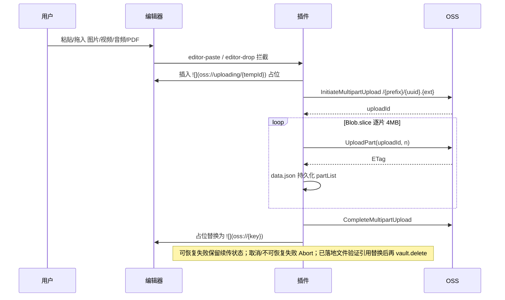

>当前文档是项目的根入口文档，定义项目全局总览框架信息
>
>Agent 接到任务需要查阅内容时优先下钻本地关联的文档，未找到再搜索网络，不单纯依赖模型预训练数据

# 是什么

>描述功能的组成要素和连接关系，每个要素和连接关系附一句话简介。先总后分，层级管理引用文档，可不断下钻。只包含与具体实现技术无关的功能描述

开发一个Obsidian插件，可以在PC端（windows、macOS）和移动端（ios、安卓）上同时兼容使用，功能点：

- 用户安装插件后，可以配置阿里云OSS操作必要的参数（参考：https://help.aliyun.com/zh/oss/user-guide/object-overview?spm=a2c4g.11186623.help-menu-31815.d_0_3_0.31dd6edcEhtEan&scm=20140722.H_177681._.OR_help-T_cn~zh-V_1）：region、endPoint、cName、bucketName...${根据实际选择的方案调整为实际有用的参数}

- 插件感知Obsidian中图片、视频、音频、PDF的上传，自动将上传的文件上传到OSS，并将OSS中文件的访问路径替换掉本地路径，然后删除本地文件

- 渲染显示的时候，对上传文件的访问路径进行动态签名和显示

- 删除上传文件时，提示是否联动删除OSS中的文件，如果确定那么进行联动删除

- 设置页提供「自动上传」开关（toggle），关闭后暂停自动上传，方便调试或离线编辑

- 设置页保存时对 OSS 凭证进行连通性校验（ping），验证 AK/SK 有效性，校验失败提前报错阻止保存

# 为什么

>描述功能的意义，按以下维度展开：
>
>- 业务价值：什么人在什么场景解决什么事
>
>- 技术价值：可监控、高安全、高可用、高扩展、高性能等
>
>- 成本与风险：实现代价与潜在风险

# 怎么样

>描述功能的具体实现。流程、约束、规则中的内容只与「是什么」描述的要素和连接关系相关

## 流程

### 配置

用户在设置页填写：`region`、`bucketName`、`accessKeyId`、`accessKeySecret`、`endpoint`（可选）、`objectKeyPrefix`（默认 vault 名）、`signedUrlExpireSeconds`（默认 3600）、`autoUpload`（默认 true）。明文存 `data.json`。

保存时插件用已填凭证对 `{objectKeyPrefix}/.oss-plugin-probe/{randomUUID}` 发送签名 GET，该随机 Key 必然不存在，只有 OSS 明确返回 `404 NoSuchKey` 或极小概率的 `200` 才视为校验成功。禁止用 ListObjects 作为凭证探针，避免插件获得枚举 Bucket 对象名称的权限。其他失败则 Notice 报错并阻止保存。`autoUpload` 为 false 时，拦截器与 `vault.on('create')` 补传均跳过上传逻辑，已有 `oss://` 链接的渲染和删除不受影响。

所有 OSS 数据 API、管理 API 和附件签名访问 URL 统一使用标准 `{bucket}.{endpoint}` Host。不提供自定义访问域名配置，避免 Bucket 归属、ACL、HTTPS 证书与 DNS 引入额外故障面。

### 上传

统一走 OSS Multipart Upload，不按大小分流。

`vault.on('create')` 只负责发现可能由 Obsidian 落地的附件，不得把当前活动文档直接视为引用来源。插件必须等待 MetadataCache 建立链接关系，并按 Obsidian 的真实链接解析结果确定每一个引用实例；在限定等待时间内找不到引用时跳过自动上传并保留本地文件。每个引用实例必须单独上传为一个 OSS Object，逐个替换并回读确认该实例已写入自己的 `oss://` 链接；同一 Markdown 内的重复引用也不共享 Object Key。只有该本地附件的全部引用实例都已独立迁移成功，才允许删除本地文件。

上传失败分为两类：网络中断、超时、5xx 等可恢复错误必须保留 `uploadId + partList` 和本地附件，供状态栏重试或下次启动继续；用户主动取消、凭证/参数错误等不可恢复错误才调用 `AbortMultipartUpload` 并清除状态。续传必须校验附件大小、扩展名与原任务一致，禁止把另一个同名文件续传到旧任务。

Multipart 完成不等于迁移完成。`CompleteMultipartUpload` 成功后任务必须进入 `uploaded`（待引用提交）状态并继续持久化 `objectKey + localPath + sourcePath`；只有编辑器占位符或所有真实引用文档均已替换并验证、本地附件按需删除后，才允许清除任务。插件重启后必须复用已完成的 Object Key 继续引用提交，禁止重复上传同一附件。

引用迁移必须先计算完整的“引用实例→独立 Object Key”计划，再逐实例上传、提交并回读验证。已成功实例不回退且不重复上传；中途失败时必须保留本地附件和未完成实例的 `uploaded/uploading` 状态供续传。附件引用定位应优先使用 Obsidian MetadataCache 的真实链接解析结果；兼容回退解析时必须支持括号、空格、尖括号与可选 title 等合法 Markdown 目标，禁止用遇到首个 `)` 即终止的简单正则判断目标范围。

粘贴或拖入同时包含支持与不支持内容时，插件不得整体 `preventDefault()` 后吞掉不支持内容。只有本次输入全部是可处理附件时才接管默认行为；混合输入交给 Obsidian 默认落盘，再由 `vault.on('create')` 精确补传。

### 渲染

Reading View 只用 `registerMarkdownPostProcessor` 处理当前渲染片段；Live Preview 与 Canvas 在 `workspace.onLayoutReady` 后共用一个增量 `MutationObserver`，只处理 `.markdown-source-view` / `.canvas-node` 中本批次发生变化的目标节点与新增子树，禁止在 Observer 回调中重新扫描 `document`。

所有渲染入口统一调用 `SignedUrlResolver`：缓存键由 `bucket + signedHost + objectKey` 组成，LRU 缓存保留至过期前 60s；同一缓存键正在签名时复用同一个 Promise；凭证、Endpoint 或有效期变化时先清空已完成和进行中的缓存，旧代请求无论成功或失败都必须转用当前配置重新解析，禁止向活动节点返回旧签名 URL。HMAC 使用按 AccessKey Secret 复用的 Web Crypto `CryptoKey`，避免每个附件重复 `importKey`。

Obsidian/Electron 规范化出的 `oss:///%E8...` 必须先恢复为原始 Object Key，再生成签名 URL。图片、视频、音频分别渲染为对应原生元素；PDF 只渲染为轻量附件卡片，名称优先取 Markdown 图片语法的 alt 文本（如 `` 中的 `报告名称.pdf`），alt 为空时才回退到 Object Key 文件名。卡片展示 PDF 类型标识、完整名称和“打开”操作，名称过长时单行省略并通过 title 保留完整内容；禁止下载 PDF 二进制、创建 Canvas、启动 Worker 或内嵌系统 PDF 查看器。每个 PDF 必须独立签名和渲染，连续多个 PDF 中单个失败不得影响其他 PDF。异步签名完成后必须再次核对节点当前 Object Key，禁止旧结果覆盖被 Obsidian 复用的节点。批量渲染必须逐节点隔离失败，失败时保留原始 `oss://` 并显示独立错误标记，允许后续视图刷新重试。

图片、视频、音频必须使用统一的“附件容器 → 媒体 → 名称”纵向布局，在媒体正下方显示 Markdown 图片语法 `[]` 中的名称，Reading View、Live Preview 与 Canvas 的位置和间距保持一致；名称为空时不显示标题，也不得回退展示 OSS UUID。标题过长时单行省略，并通过 `title` 保留完整名称。音频播放器、音频附件容器和 PDF 卡片在 Reading View、Live Preview 与 Canvas 中都必须按父容器 `width: 100%` 占满正文可用行宽，禁止使用固定像素宽度或依赖屏幕分辨率；Live Preview 必须在渲染时给实际的 `.image-wrapper`、`.cm-embed-block`、`.internal-embed` 和所在 `.cm-line` 添加专用展开类。尤其禁止遗漏 Obsidian 默认 `display:inline-flex` 的 `.image-wrapper`，否则其收缩宽度会把音频压成 0px、把 PDF 卡片限制为内容宽度。只允许添加样式类，禁止替换这些 CodeMirror 编辑入口节点。

媒体渲染必须避免无意义的 OSS 数据流量：PDF 卡片只挂载可点击的签名链接，未点击时不得请求 PDF 内容；音频挂载签名 URL 时必须使用 `preload="none"`，允许原生播放器正常识别音源但不得预下载音频内容；视频只在进入视口附近时挂载签名 URL 并使用 `preload="metadata"` 读取小段数据展示首帧，视口外不得提前请求；图片只在进入视口附近时挂载签名 URL，不可见的长文档和 Canvas 图片不得提前下载。延迟图片占位节点必须保留非零布局区域，禁止用 `display:none` 造成可见性观察死锁。环境不支持可见性观察时允许立即加载图片和视频，以保证兼容性。Live Preview 中 Obsidian 未生成原生媒体元素、只生成带 `src` 的 `.internal-embed` 时，插件必须保留该可编辑宿主并在其内部挂载正确的媒体元素。

OSS 附件的右键菜单由插件统一接管，禁止让 Obsidian 将视频、音频和 PDF 显示为“复制图片 / Remove image / 重置大小”。菜单项必须按图片、视频、音频、PDF 显示对应名称，提供打开附件、复制临时访问链接、复制永久 `oss://` Markdown 引用；仅在能确认来源 Markdown 时提供“移除引用”。移除时必须按当前唯一 Object Key 先确认是否联动删除；用户选择保留 OSS 时只移除引用，用户确认联动删除时先删除 OSS Object，只有远端删除成功或明确返回 404 时才精确删除一个 Markdown 引用。网络或 OSS 删除失败时必须保留本文档引用，Canvas 或来源不确定时禁止猜测修改文件。

### 删除

`vault.on('modify')` debounce 1s 后 diff 出被移除的 `oss://{key}`，弹 Modal 确认后 `requestUrl DELETE /{key}`。不做跨文档引用统计，删错以用户确认为准。

删除监听必须先同步注册 `create/modify/delete/rename` 事件，再并发建立现有 Markdown 的引用基线，禁止扫描完成后才监听。初始化期间发生的修改必须排队到该文件基线建立后再 diff；启动后新建或导入的 Markdown 必须单独建立基线。rename 必须同步迁移引用基线、初始化状态与 debounce timer，delete 必须取消该文件 timer，避免旧路径任务重复弹窗。

删除单条引用时确认项默认选中；删除整篇 Markdown 时远端对象默认不选中，必须由用户主动逐项选择，因为一次文档删除可能影响多个对象。确认弹窗只代表当前文档，不暗示其他文档没有引用。

## 约束

- 必须只用 `requestUrl` 收发 HTTP，禁止使用 `fetch/XHR/ali-oss` SDK，因为要兼容移动端且绕 CORS。
- OSS 上传、删除、分片列表、中止和签名访问必须始终走标准 Bucket Endpoint，禁止引入自定义访问 Host。
- 必须只用 Web Crypto (`crypto.subtle`) 做签名，禁止使用 Node `crypto/fs/stream/Buffer`。
- 必须处理的附件类型：图片(png/jpg/jpeg/gif/webp/avif/svg/bmp)、视频(mp4/mov/webm/mkv/ogv/m4v)、音频(mp3/wav/m4a/ogg/flac/aac/opus)、PDF；其他类型必须不动。
- Markdown (`.md`)、Canvas (`.canvas`) 和 Base (`.base`) 属于 Vault 内可编辑、可查询的结构化内容，禁止自动上传到 OSS；必须保留在 Vault 中参与链接、搜索和编辑。
- md 中必须以标准 markdown 语法 `` 占位存储，禁止使用 wikilink 或 HTML 内嵌，禁止直接写入带签名的 URL，因为渲染管线只处理单一形式且签名会过期。
- 附件若已落地为本地文件，必须在 `CompleteMultipartUpload` 成功后再 `vault.delete`，禁止先删后传。
- 附件若已落地为本地文件，只有在所有真实引用文档修改成功并回读验证后才允许 `vault.delete`；无引用、引用解析不确定、任一文档读写失败时必须保留本地文件并提示用户。
- `CompleteMultipartUpload` 成功后禁止立即删除 pending 状态；引用提交完成前必须保留可跨重启恢复的 `uploaded` 状态，避免重复对象和半迁移任务失联。
- 多文档引用提交失败时禁止留下无恢复信息的半迁移状态；安全回滚或持久化逐文档提交进度至少满足其一。
- 本地引用替换必须通过 Obsidian MetadataCache/链接解析结果确认目标附件，禁止仅按 basename 在全库正则替换，因为不同目录可能存在同名附件。
- 拦截路径上传失败必须将 blob 回写为本地文件并移除占位链接，禁止直接丢弃数据。
- 删除远端前必须二次确认，禁止跨文档引用统计带来的复杂度，误删责任由用户承担。
- 删除监听初始化期间禁止存在事件监听空窗；新建 Markdown 的首次引用删除也必须能被识别。
- 整篇文档删除触发的远端对象必须默认不选中，禁止将批量永久删除作为默认操作。
- objectKey 必须由 `{objectKeyPrefix}/{crypto.randomUUID()}.{ext}` 组成，禁止依赖内容哈希，因为流式分片无法边传边算 SHA-1；不做内容去重，孤儿文件由用户自行清理。
- 每个 Markdown 附件引用实例必须独占一个 OSS Object Key，禁止在不同文档或同一文档的重复引用之间共享自动上传产生的 Object；用户手工复制已有 `oss://` 链接不在自动隔离范围内。
- 单个引用实例的修改必须采用“上传新 Object→替换并验证引用→再处理旧 Object”的顺序，禁止原地覆盖或先删旧对象。
- 必须对所有附件统一走 OSS Multipart Upload，禁止使用一次性 PutObject，因为路径唯一化便于维护与续传。
- 必须只在用户取消或确认不可恢复的上传失败时调 `AbortMultipartUpload`；可恢复错误必须保留续传状态，并由 24h 超时清理兜底，兼顾断点续传与孤儿分片成本。
- `autoUpload` 为 false 时必须完全跳过拦截与补传，禁止排队或静默上传，因为用户明确暂停意味着不产生任何网络请求。
- 设置页保存必须先通过凭证校验再持久化，禁止存入无效凭证，因为后续上传会静默失败且用户难以定位原因。
- MutationObserver 回调必须只处理本批次变更节点和新增子树，禁止调用 `document.querySelectorAll` 或等价的全页扫描，因为 Obsidian 编辑、滚动和拖动 Canvas 会高频修改 DOM。
- Reading View、Live Preview、Canvas 必须有单一渲染责任方，禁止同一视图由两套渲染器竞争写入 URL；Reading View 归 Post Processor，Live Preview/Canvas 归增量 Observer。
- OSS 附件右键菜单必须阻止 Obsidian 图片菜单继续冒泡，并且只能对当前 Object Key 和可确认的来源 Markdown 执行操作；禁止因 DOM 外层仍为 `.image-embed` 就展示图片专属操作。
- 右键菜单移除 OSS 附件时必须遵循“确认联动删除 → 删除 OSS Object → 删除当前 Markdown 引用”的顺序；远端删除失败时禁止修改 Markdown，避免引用先丢失后无法重试远端删除。
- 渲染监听必须延迟到 `workspace.onLayoutReady` 注册，并在插件卸载时断开，因为冷启动阶段不应执行全局 DOM 工作。
- 同一批附件必须并发解析且逐项隔离异常，禁止用会因单项失败而整体 reject 的裸 `Promise.all`。
- 未配置 Bucket/AK/SK 时必须在签名前失败并保留 `oss://`，禁止生成无效 HTTPS URL 覆盖可重试源地址。
- 设置切换必须在第一个异步持久化等待前清空签名状态，且 `onLayoutReady` 回调必须检查插件是否已经卸载，禁止旧配置和卸载后的监听回写 DOM。
- PDF 展示必须只生成签名链接按钮，禁止引入 PDF.js、Worker、Canvas 或 PDF 二进制下载，因为最高性能优先且多个 PDF 必须互不争用渲染资源。
- 音频必须使用 `preload="none"` 避免播放前下载内容，但不得移除 HTTPS `src` 而破坏原生播放；图片和视频必须优先近视口懒加载，视频仅允许 `preload="metadata"` 用于首帧识别，因为用户可识别内容比绝对零请求更重要，但视口外不应产生 OSS 下行流量。
- OSS 图片必须由插件提供可见的放大操作和独立预览 Modal，禁止依赖 Obsidian 只能解析 Vault 本地附件的原生放大链路。
- Live Preview 中 OSS 图片必须同时保留 Obsidian 原生控件和插件的 OSS 放大按钮；OSS 按钮必须向左错开原生按钮区域，禁止重叠。定位样式必须限定在 `.oss-image-preview-host` 内，禁止影响本地图片。Obsidian 原生“查看文件”对 `oss://` 可能无效，但按用户要求保留。
- 粘贴/拖拽拦截必须在事件句柄失效前并发快照所有已接管 `File` 的字节，后续上传与失败回写必须共用稳定 Blob，禁止在长时间异步上传后再读取可能已被系统撤销的原始 `File` 句柄。
- 输入附件读取返回 `NotReadableError` 或 `The requested file could not be read` 时，Notice 必须通用地提示“文件可能仅存在云盘（如 iCloud、OneDrive 等），请先下载到本地后重试”，禁止绑定单一云盘品牌或只暴露浏览器原始英文异常。
- PDF 展示名称必须优先沿用 Markdown alt 文本，禁止只显示 UUID Object Key 文件名，因为用户上传时的语义名称比存储键更有辨识度。

## 规则

- 每次代码实现完成并通过验证后，默认执行 `npm run deploy:test` 部署到 `/Users/xukai/xukai_workspace/许凯测试oss插件/.obsidian/plugins/unchanged-attachments-to-oss`，方便用户立即验证；部署只更新 `main.js`、`manifest.json`、`styles.css`，禁止覆盖测试 Vault 中的 `data.json`。

- 推荐优先在 `editor-paste/editor-drop` 阶段拦截 blob 直传，因为可避免本地落盘再删的往返。
- 推荐分片固定 4 MB 并用 `Blob.slice` 惰性切片，因为可兼顾移动端内存与 RTT 数量。
- 推荐在 `data.json` 持久化 `uploadId + partList` 以支持断点续传，因为大视频常见网络中断。
- 推荐重试任务同时持久化本地附件路径、文件大小和更新时间，因为插件重启后仍需恢复失败任务且必须防止错传同名文件。
- 推荐启动时清理 24h 以上未完成的 MultipartUpload，因为可避免长期孤儿计费。
- 推荐用私有 Bucket + 客户端 V1 签名，因为无需服务端且 URL 短。
- 推荐签名 URL 内存缓存（LRU，`bucket + signedHost + key`→`{url, expireAt}`）并缓存 in-flight Promise，因为可消除滚动、Canvas 卡片与正文并发渲染造成的重复签名。
- 推荐复用 Web Crypto 导入后的 HMAC `CryptoKey`，因为 AccessKey Secret 不变时重复 `importKey` 是无意义开销。
- 推荐上传失败保留本地文件并在状态栏提示重试，因为可避免网络抖动造成数据丢失。
- 推荐提供"迁移指定文件夹附件"和"迁移全部附件"两条命令，因为支持先小范围验证再全量迁移。
- 推荐迁移前展示附件数量并二次确认，迁移后保留逐文件成功/失败结果；没有真实引用的附件默认跳过，因为上传后立即删除会失去本地可发现性。
- 推荐凭证校验对每次随机且不存在的保留 Key 发送签名 GET，并且只将 `NoSuchKey` 视为预期成功，因为它能验证 Bucket、Endpoint、签名和 `GetObject` 权限，又不会列举、创建或下载真实对象。
- 推荐 `autoUpload` 开关变更时在状态栏展示当前状态图标，因为可让用户随时确认上传是否启用。
- 推荐 PDF 附件卡片使用类型标识、原始语义文件名和清晰的“打开”按钮，并适配 Obsidian 明暗主题，因为用户应一眼识别附件类型和内容。
- 推荐 PDF 附件卡片在 Reading View、Live Preview 和 Canvas 中统一占满宿主可用行宽；Live Preview 必须同时展开 Obsidian 的 embed 宿主容器，禁止只给卡片设置 `width: 100%` 后仍受内联父容器收缩限制。
- Live Preview 展开 PDF 宿主时只能添加样式类并替换原始媒体节点，禁止替换 `.cm-embed-block`、`.internal-embed`、`.cm-line` 等 CodeMirror 宿主，因为这些节点同时承载 Markdown 原文的编辑入口。
- 推荐语言简洁凝练，因为节省token
