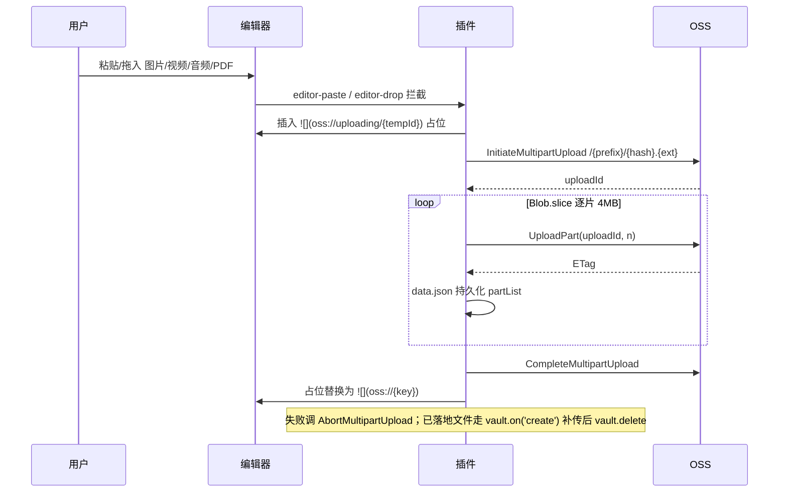

>当前文档是项目的根入口文档，定义项目全局总览框架信息
>
>Agent 接到任务需要查阅内容时优先下钻本地关联的文档，未找到再搜索网络，不单纯依赖模型预训练数据

# 是什么

>描述功能的组成要素和连接关系，每个要素和连接关系附一句话简介。先总后分，层级管理引用文档，可不断下钻。只包含与具体实现技术无关的功能描述

开发一个Obsidian插件，可以在PC端（windows、macOS）和移动端（ios、安卓）上同时兼容使用，功能点：

- 用户安装插件后，可以配置阿里云OSS操作必要的参数（参考：https://help.aliyun.com/zh/oss/user-guide/object-overview?spm=a2c4g.11186623.help-menu-31815.d_0_3_0.31dd6edcEhtEan&scm=20140722.H_177681._.OR_help-T_cn~zh-V_1）：region、endPoint、cName、bucketName...${根据实际选择的方案调整为实际有用的参数}

- 插件感知Obsidian中图片、视频、音频、PDF的上传，自动将上传的文件上传到OSS，并将OSS中文件的访问路径替换掉本地路径，然后删除本地文件

- 渲染显示的时候，对上传文件的访问路径进行动态签名和显示

- 删除上传文件时，提示是否联动删除OSS中的文件，如果确定那么进行联动删除

# 为什么

>描述功能的意义，按以下维度展开：
>
>- 业务价值：什么人在什么场景解决什么事
>
>- 技术价值：可监控、高安全、高可用、高扩展、高性能等
>
>- 成本与风险：实现代价与潜在风险

# 怎么样

>描述功能的具体实现。流程、约束、规则中的内容只与「是什么」描述的要素和连接关系相关

## 流程

### 配置

用户在设置页填写：`region`、`bucketName`、`accessKeyId`、`accessKeySecret`、`endpoint`（可选）、`cname`（可选）、`objectKeyPrefix`（默认 vault 名）、`signedUrlExpireSeconds`（默认 3600）。明文存 `data.json`。

### 上传

统一走 OSS Multipart Upload，不按大小分流。

### 渲染

Reading View 用 `registerMarkdownPostProcessor` 遍历 `img/video/audio/a`，Live Preview 用 CM6 Decoration，将 `oss://{key}` 替换为签名 URL：`https://{bucket}.{endpoint}/{key}?OSSAccessKeyId=&Expires=&Signature=`。签名结果按 key 缓存至过期前 60s。

### 删除

`vault.on('modify')` diff 出被移除的 `oss://{key}`，弹 Modal 确认后 `requestUrl DELETE /{key}`。

## 约束

- 必须只用 `requestUrl` 收发 HTTP，禁止使用 `fetch/XHR/ali-oss` SDK，因为要兼容移动端且绕 CORS。
- 必须只用 Web Crypto (`crypto.subtle`) 做签名，禁止使用 Node `crypto/fs/stream/Buffer`。
- 必须处理的附件类型：图片(png/jpg/jpeg/gif/webp/svg/bmp)、视频(mp4/mov/webm/mkv)、音频(mp3/wav/m4a/ogg/flac)、PDF；其他类型必须不动。
- md 中必须以 `oss://{objectKey}` 占位存储，禁止直接写入带签名的 URL，因为签名会过期。
- 上传成功前禁止删除本地文件；删除远端前必须二次确认。
- objectKey 必须由 vault 名前缀 + 内容 SHA-1 + 原扩展名组成，避免多设备重复上传与冲突。
- 必须对所有附件统一走 OSS Multipart Upload，禁止使用一次性 PutObject，因为路径唯一化便于维护与续传。
- 必须在上传失败或用户取消时调 `AbortMultipartUpload`，禁止留孤儿分片，因为会持续计费。

## 规则

- 推荐优先在 `editor-paste/editor-drop` 阶段拦截 blob 直传，因为可避免本地落盘再删的往返。
- 推荐分片固定 4 MB 并用 `Blob.slice` 惰性切片，因为可兼顾移动端内存与 RTT 数量。
- 推荐在 `data.json` 持久化 `uploadId + partList` 以支持断点续传，因为大视频常见网络中断。
- 推荐启动时清理 24h 以上未完成的 MultipartUpload，因为可避免长期孤儿计费。
- 推荐用私有 Bucket + 客户端 V1 签名，因为无需服务端且 URL 短。
- 推荐签名 URL 内存缓存（LRU，key→{url, expireAt}），因为可减少滚动时的重复签名开销。
- 推荐上传失败保留本地文件并在状态栏提示重试，因为可避免网络抖动造成数据丢失。
- 推荐 MVP 先只做 Reading View + 图片，后续再扩展 Live Preview 与其他媒体，因为 CM6 装饰器开发成本高。
- 推荐提供"一键迁移已有附件"命令，因为存量 vault 无法靠事件感知补齐。
- 推荐语言简洁凝练，因为节省token