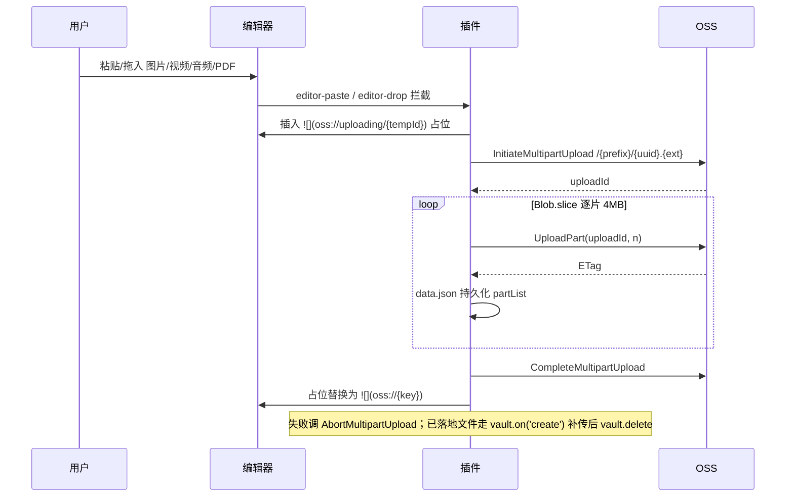

>当前文档是项目的根入口文档，定义项目全局总览框架信息
>
>Agent 接到任务需要查阅内容时优先下钻本地关联的文档，未找到再搜索网络，不单纯依赖模型预训练数据

# 是什么

>描述功能的组成要素和连接关系，每个要素和连接关系附一句话简介。先总后分，层级管理引用文档，可不断下钻。只包含与具体实现技术无关的功能描述

开发一个Obsidian插件，可以在PC端（windows、macOS）和移动端（ios、安卓）上同时兼容使用，功能点：

- 用户安装插件后，可以配置阿里云OSS操作必要的参数（参考：https://help.aliyun.com/zh/oss/user-guide/object-overview?spm=a2c4g.11186623.help-menu-31815.d_0_3_0.31dd6edcEhtEan&scm=20140722.H_177681._.OR_help-T_cn~zh-V_1）：region、endPoint、cName、bucketName...${根据实际选择的方案调整为实际有用的参数}

- 插件感知Obsidian中图片、视频、音频、PDF的上传，自动将上传的文件上传到OSS，并将OSS中文件的访问路径替换掉本地路径，然后删除本地文件

- 渲染显示的时候，对上传文件的访问路径进行动态签名和显示

- 删除上传文件时，提示是否联动删除OSS中的文件，如果确定那么进行联动删除

- 设置页提供「自动上传」开关（toggle），关闭后暂停自动上传，方便调试或离线编辑

- 设置页保存时对 OSS 凭证进行连通性校验（ping），验证 AK/SK 有效性，校验失败提前报错阻止保存

对应的 Obsidian 测试路径为：/Users/xukai/xukai_workspace/许凯测试oss插件

# 为什么

>描述功能的意义，按以下维度展开：
>
>- 业务价值：什么人在什么场景解决什么事
>
>- 技术价值：可监控、高安全、高可用、高扩展、高性能等
>
>- 成本与风险：实现代价与潜在风险

# 怎么样

>描述功能的具体实现。流程、约束、规则中的内容只与「是什么」描述的要素和连接关系相关

## 流程

### 配置

用户在设置页填写：`region`、`bucketName`、`accessKeyId`、`accessKeySecret`、`endpoint`（可选）、`cname`（可选）、`objectKeyPrefix`（默认 vault 名）、`signedUrlExpireSeconds`（默认 3600）、`autoUpload`（默认 true）。明文存 `data.json`。

保存时插件用已填凭证向 OSS 发送轻量请求（如 `GET /?buckets` 或 `HEAD /`）验证连通性与权限，失败则 Notice 报错并阻止保存。`autoUpload` 为 false 时，拦截器与 `vault.on('create')` 补传均跳过上传逻辑，已有 `oss://` 链接的渲染和删除不受影响。

### 上传

统一走 OSS Multipart Upload，不按大小分流。

### 渲染

Reading View 只用 `registerMarkdownPostProcessor` 处理当前渲染片段；Live Preview 与 Canvas 在 `workspace.onLayoutReady` 后共用一个增量 `MutationObserver`，只处理 `.markdown-source-view` / `.canvas-node` 中本批次发生变化的目标节点与新增子树，禁止在 Observer 回调中重新扫描 `document`。

所有渲染入口统一调用 `SignedUrlResolver`：缓存键由 `bucket + signedHost + objectKey` 组成，LRU 缓存保留至过期前 60s；同一缓存键正在签名时复用同一个 Promise；凭证、Endpoint、CNAME 或有效期变化时先清空已完成和进行中的缓存，旧代请求无论成功或失败都必须转用当前配置重新解析，禁止向活动节点返回旧签名 URL。HMAC 使用按 AccessKey Secret 复用的 Web Crypto `CryptoKey`，避免每个附件重复 `importKey`。

Obsidian/Electron 规范化出的 `oss:///%E8...` 必须先恢复为原始 Object Key，再生成签名 URL。图片、视频、音频分别渲染为对应原生元素；PDF 只渲染为轻量附件行，显示文件名和“浏览器打开”按钮，禁止下载 PDF 二进制、创建 Canvas、启动 Worker 或内嵌系统 PDF 查看器。每个 PDF 必须独立签名和渲染，连续多个 PDF 中单个失败不得影响其他 PDF。异步签名完成后必须再次核对节点当前 Object Key，禁止旧结果覆盖被 Obsidian 复用的节点。批量渲染必须逐节点隔离失败，失败时保留原始 `oss://` 并显示独立错误标记，允许后续视图刷新重试。

### 删除

`vault.on('modify')` debounce 1s 后 diff 出被移除的 `oss://{key}`，弹 Modal 确认后 `requestUrl DELETE /{key}`。不做跨文档引用统计，删错以用户确认为准。

## 约束

- 必须只用 `requestUrl` 收发 HTTP，禁止使用 `fetch/XHR/ali-oss` SDK，因为要兼容移动端且绕 CORS。
- 必须只用 Web Crypto (`crypto.subtle`) 做签名，禁止使用 Node `crypto/fs/stream/Buffer`。
- 必须处理的附件类型：图片(png/jpg/jpeg/gif/webp/svg/bmp)、视频(mp4/mov/webm/mkv)、音频(mp3/wav/m4a/ogg/flac)、PDF；其他类型必须不动。
- md 中必须以标准 markdown 语法 `` 占位存储，禁止使用 wikilink 或 HTML 内嵌，禁止直接写入带签名的 URL，因为渲染管线只处理单一形式且签名会过期。
- 附件若已落地为本地文件，必须在 `CompleteMultipartUpload` 成功后再 `vault.delete`，禁止先删后传。
- 拦截路径上传失败必须将 blob 回写为本地文件并移除占位链接，禁止直接丢弃数据。
- 删除远端前必须二次确认，禁止跨文档引用统计带来的复杂度，误删责任由用户承担。
- objectKey 必须由 `{objectKeyPrefix}/{crypto.randomUUID()}.{ext}` 组成，禁止依赖内容哈希，因为流式分片无法边传边算 SHA-1；不做内容去重，孤儿文件由用户自行清理。
- 必须对所有附件统一走 OSS Multipart Upload，禁止使用一次性 PutObject，因为路径唯一化便于维护与续传。
- 必须在上传失败或用户取消时调 `AbortMultipartUpload`，禁止留孤儿分片，因为会持续计费。
- `autoUpload` 为 false 时必须完全跳过拦截与补传，禁止排队或静默上传，因为用户明确暂停意味着不产生任何网络请求。
- 设置页保存必须先通过凭证校验再持久化，禁止存入无效凭证，因为后续上传会静默失败且用户难以定位原因。
- MutationObserver 回调必须只处理本批次变更节点和新增子树，禁止调用 `document.querySelectorAll` 或等价的全页扫描，因为 Obsidian 编辑、滚动和拖动 Canvas 会高频修改 DOM。
- Reading View、Live Preview、Canvas 必须有单一渲染责任方，禁止同一视图由两套渲染器竞争写入 URL；Reading View 归 Post Processor，Live Preview/Canvas 归增量 Observer。
- 渲染监听必须延迟到 `workspace.onLayoutReady` 注册，并在插件卸载时断开，因为冷启动阶段不应执行全局 DOM 工作。
- 同一批附件必须并发解析且逐项隔离异常，禁止用会因单项失败而整体 reject 的裸 `Promise.all`。
- 未配置 Bucket/AK/SK 时必须在签名前失败并保留 `oss://`，禁止生成无效 HTTPS URL 覆盖可重试源地址。
- 设置切换必须在第一个异步持久化等待前清空签名状态，且 `onLayoutReady` 回调必须检查插件是否已经卸载，禁止旧配置和卸载后的监听回写 DOM。
- PDF 展示必须只生成签名链接按钮，禁止引入 PDF.js、Worker、Canvas 或 PDF 二进制下载，因为最高性能优先且多个 PDF 必须互不争用渲染资源。

## 规则

- 推荐优先在 `editor-paste/editor-drop` 阶段拦截 blob 直传，因为可避免本地落盘再删的往返。
- 推荐分片固定 4 MB 并用 `Blob.slice` 惰性切片，因为可兼顾移动端内存与 RTT 数量。
- 推荐在 `data.json` 持久化 `uploadId + partList` 以支持断点续传，因为大视频常见网络中断。
- 推荐启动时清理 24h 以上未完成的 MultipartUpload，因为可避免长期孤儿计费。
- 推荐用私有 Bucket + 客户端 V1 签名，因为无需服务端且 URL 短。
- 推荐签名 URL 内存缓存（LRU，`bucket + signedHost + key`→`{url, expireAt}`）并缓存 in-flight Promise，因为可消除滚动、Canvas 卡片与正文并发渲染造成的重复签名。
- 推荐复用 Web Crypto 导入后的 HMAC `CryptoKey`，因为 AccessKey Secret 不变时重复 `importKey` 是无意义开销。
- 推荐上传失败保留本地文件并在状态栏提示重试，因为可避免网络抖动造成数据丢失。
- 推荐提供"迁移指定文件夹附件"和"迁移全部附件"两条命令，因为支持先小范围验证再全量迁移。
- 推荐凭证校验用 `requestUrl HEAD /{bucket}.{endpoint}/` 或 `GET /?list-type=2&max-keys=1`，因为开销最小且能同时验证 Bucket 可达与签名有效。
- 推荐 `autoUpload` 开关变更时在状态栏展示当前状态图标，因为可让用户随时确认上传是否启用。
- 推荐 PDF 附件行使用文件名和“浏览器打开”按钮，因为用户可按需查看且不会消耗内嵌渲染资源。
- 推荐语言简洁凝练，因为节省token
