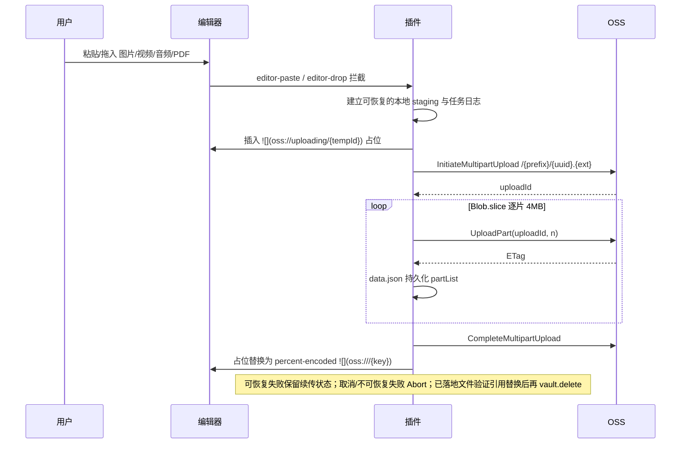

> 本文是上传与迁移功能的下钻文档；全局约束仍以 [`CLAUDE.md`](../CLAUDE.md) 为准。

# 是什么

把新输入或已落地附件迁移到 OSS，并将本地引用安全替换为可恢复、可跨设备同步的永久 `oss://` 引用。

# 为什么

网络中断、应用重载和多文档引用迁移都可能造成数据丢失或半完成状态，因此必须先保留本地保险副本，再以可续传任务完成上传、引用提交和本地清理。

# 怎么样

## 流程

统一走 OSS Multipart Upload，不按大小分流。

`editor-paste/editor-drop` 监听在插件加载时立即注册。接管输入后，必须先在 Vault 根目录 `.oss-plugin-staging/` 创建可跨重启恢复的 `{tempId}.{ext}.stage`，再上传；该目录文件只可通过 Vault API 创建、读取和删除，禁止以进程内 Blob 为唯一数据源。`vault.on('create')`、迁移与核验必须排除该目录，任务进入 `done` 后立即清理。占位符必须在事件回调内一次插入，作为成功和失败原位回写的唯一锚点，禁止使用上传前的旧光标位置。

`vault.on('create')` 兜底监听必须在 `workspace.onLayoutReady` 后注册，只处理本次运行新落地的附件，禁止接收冷启动补发事件或把当前活动文档直接视为引用来源。等待 MetadataCache 建立链接关系后，先从 `resolvedLinks` 找候选 Markdown，再只读取候选文档并按真实解析结果确定每个引用实例；重试不得扫描全 Vault。限时内找不到引用则跳过并保留本地文件。每个自动上传产生的引用实例（包括同一 Markdown 的重复引用）必须独占 OSS Object，逐个替换、回读确认；手工复制已有 `oss://` 链接除外。全部实例迁移成功且删除前重新确认无新增本地引用，才可删除本地文件。

“管理本地保险副本”只扫描 `.oss-plugin-staging/`，不得扫描全 Vault 或自动请求 OSS。界面统一称其为“上传中断时用于防止附件丢失的本地保险副本”，禁止使用 staging、journal 等内部术语；显示数量、总占用和逐项状态。关联任务副本只可重试，不可直接删除；无关联副本优先提供“恢复到附件目录”。永久删除无关联副本必须逐项触发、再次确认并说明不可恢复，默认不选中，禁止批量或按文件年龄自动清理。任务完成并验证引用后立即自动清理。

插件禁用或热重载时必须同步进入 `quiescing`：已经接管并开始读取的 File 仍需完成 staging 与任务日志落盘；已发出的 OSS 请求只允许持久化其安全结果，禁止继续下一次网络请求、提交引用或删除本地文件。所有异步根任务必须被生命周期统一跟踪。跨热重载实例必须通过 `globalThis + Symbol.for(pluginId)` 共享 generation 与持久化队列：新实例读取 `data.json` 前等待旧实例 drain，旧 generation 此后禁止整包 `saveData`，避免迟到写入覆盖新实例的 pending journal。

上传失败分两类：网络中断、超时、5xx 等可恢复错误保留 `uploadId + partList` 和本地附件，供状态栏或下次启动续传；主动取消、凭证/参数错误等不可恢复错误才 `AbortMultipartUpload` 并清除状态。续传必须校验附件大小、扩展名与原任务一致，禁止把同名的另一文件续传到旧任务。

Multipart 完成不等于迁移完成。任务状态至少覆盖 `staged → uploading → completing → uploaded → reference_committing → cleanup_pending → done`。调用 Complete 前必须先持久化 `completing`；响应不确定时用目标 Object HEAD 复核；若 HEAD 404 没有可区分 Bucket/Object 的错误体，只允许再发 `Range: bytes=0-0` 的轻量 GetObject 区分 `NoSuchKey` 与 `NoSuchBucket`，禁止下载完整附件或把任意 404 当成 Object 不存在。任务必须持久化 `objectKey + localPath/stagingPath + sourcePath + placeholder/occurrence locator + storageIdentity`；只有编辑器占位符或所有真实引用文档均已替换并验证、本地附件或 staging 清理成功后，才允许进入 `done` 并清除任务。插件重启后必须复用已完成的 Object Key 继续引用提交，禁止重复上传同一附件。

引用迁移必须先计算完整的“引用实例→独立 Object Key”计划，再逐实例上传、提交、回读验证。成功实例不回退、不重传；中途失败时保留本地附件及未完成实例的 `uploaded/uploading` 状态。定位优先使用 MetadataCache 的真实链接解析结果，禁止按 basename 全库正则替换；回退解析必须支持括号、空格、尖括号和可选 title 等合法 Markdown 目标，禁止以首个 `)` 判断目标结束。

附件迁移必须用 `MetadataCache.resolvedLinks` 生成候选附件和 Markdown，只读取候选文档确认真实引用实例。“迁移指定文件夹附件”不得读取全 Vault Markdown，但必须纳入候选附件在范围外 Markdown 中的引用。自动补传可使用仅存于运行期的反向链接缓存；MetadataCache 重新解析后必须失效，禁止写入 `data.json`。

粘贴或拖入同时包含支持与不支持的 File 时，插件不得整体 `preventDefault()` 后吞掉不支持文件。只有本次 File 列表全部是可处理附件时才接管默认行为；剪贴板随文件附带的 `text/plain`、`text/html`、文件名或 URL 属于同一内容的替代表达，不得仅因这些 string item 放弃直传。真正含不支持 File 的混合输入交给 Obsidian 默认落盘，再由 `vault.on('create')` 精确补传。

## 约束

- 多文档引用提交失败时禁止留下无恢复信息的半迁移状态；安全回滚或持久化逐文档提交进度至少满足其一。
- 拦截路径必须先持久化 staging 再上传；上传失败时必须确认本地数据已存在后再把占位原位替换为本地链接，禁止先删占位或直接丢弃数据。
- 本地保险副本管理不得删除任何仍被 `pendingUploads` 的 `stagingPath` 或内部 `localPath` 引用的文件；无关联副本永久删除前必须再次按当前任务状态复核，防止列表打开后新任务认领该文件。
- objectKey 必须由 `{objectKeyPrefix}/{crypto.randomUUID()}.{ext}` 组成，禁止依赖内容哈希，因为流式分片无法边传边算 SHA-1；不做内容去重，孤儿文件由用户自行清理。
- 单个引用实例的修改必须采用“上传新 Object→替换并验证引用→再处理旧 Object”的顺序，禁止原地覆盖或先删旧对象。
- 同一批附件必须并发解析且逐项隔离异常，禁止用会因单项失败而整体 reject 的裸 `Promise.all`。
- 粘贴/拖拽拦截必须在事件句柄失效前并发快照所有已接管 `File` 的字节，后续上传与失败回写必须共用稳定 Blob，禁止在长时间异步上传后再读取可能已被系统撤销的原始 `File` 句柄。
- 输入附件读取返回 `NotReadableError` 或 `The requested file could not be read` 时，Notice 必须通用地提示“文件可能仅存在云盘（如 iCloud、OneDrive 等），请先下载到本地后重试”，禁止绑定单一云盘品牌或只暴露浏览器原始英文异常。

## 规则

- 推荐优先在 `editor-paste/editor-drop` 阶段拦截 blob 直传，因为可避免本地落盘再删的往返。
- 推荐分片固定 4 MB 并用 `Blob.slice` 惰性切片，因为可兼顾移动端内存与 RTT 数量。
- 推荐重试任务同时持久化本地附件路径、文件大小和更新时间，因为插件重启后仍需恢复失败任务且必须防止错传同名文件。
- 推荐在设置页和命令面板提供 24h 以上未完成 MultipartUpload 的手动清理入口；禁止启动时自动请求 OSS，因为维护任务不应影响文档打开。
- 推荐同时在设置页和命令面板提供未完成任务数量与重试入口，因为 Obsidian 移动端没有状态栏；放弃任务必须另行设计本地数据保留与已完成 Object 的处理语义，禁止用“清空状态”冒充取消。
- 推荐提供“迁移指定文件夹附件”和“迁移全部附件”两条命令，因为支持先小范围验证再全量迁移。
- 推荐迁移前展示附件数量并二次确认，迁移后保留逐文件成功/失败结果；没有真实引用的附件默认跳过，因为上传后立即删除会失去本地可发现性。
- 推荐 `autoUpload` 开关变更时在状态栏展示当前状态图标，因为可让用户随时确认上传是否启用。
